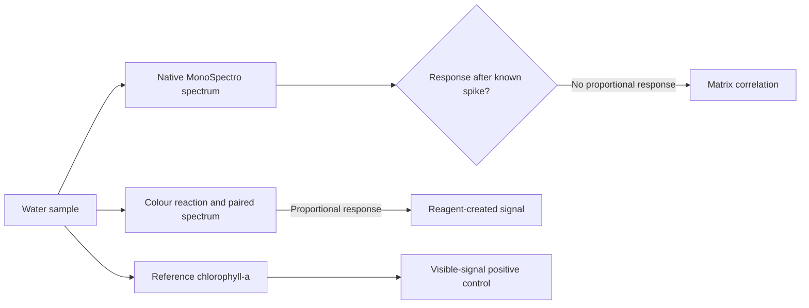

# MonoSpectro Brussels Lake Correlation Campaign

> Can a low-cost visible spectrometer distinguish a real reagent-created nutrient signal from a correlation carried by the water matrix?

This repository holds the **protocol, field records, spectra, reference measurements, analysis code, and results** for the Brussels urban-lake campaign. The manuscript belongs in a separate repository.

## Current status

**Pre-field.** No campaign water samples, spectra, concentrations, or field results are stored here.

The frozen protocol fixes the sampling design, standard-addition test, validation partitions, metrics, and failure criteria before campaign data are observed. Five public-park water bodies are listed as **candidates**. Their planning coordinates appear in the [interactive map](docs/sampling-map.html) and in [SAMPLING_SITES.md](SAMPLING_SITES.md). Public access does not itself authorize water collection: the responsible manager must confirm the sampling condition before a bottle is filled.

## The claim under test



Chlorophyll-a is the positive control because it has an intrinsic visible signature. Orthophosphate, ammonium, and nitrite do not. A native-spectrum nutrient model can therefore look accurate by reading pigment, colour, or turbidity covariation. The standard-addition test is the falsification step: a known spike increases the reference concentration while a native visible spectrum should not acquire a nutrient signature; a signal caused by the colour reagent should respond proportionally.

## Repository guide

| Path | Contents |
| --- | --- |
| [PROTOCOLO_CONGELADO.md](PROTOCOLO_CONGELADO.md) | Frozen design and decision rules. |
| [SAMPLING_SITES.md](SAMPLING_SITES.md) | Five candidate water bodies, planning coordinates, managers, and permission status. |
| [docs/sampling-map.html](docs/sampling-map.html) | Interactive map of the five planning coordinates. |
| [TARGET_COMPOUNDS_AND_METHODS.md](TARGET_COMPOUNDS_AND_METHODS.md) | Editable instrument and reagent decision sheet. |
| [templates/](templates) | Empty CSV schemas and printable English field sheets. |
| [data/raw/](data/raw) | Untouched instrument exports and original readings. |
| [data/processed/](data/processed) | Completed, traceable copies of field and assay records. |
| [data/products/](data/products) | Derived analysis tables. |
| [src/analysis.py](src/analysis.py) | Leave-one-lake-out and standard-addition analysis. |
| [tests/test_synthetic.py](tests/test_synthetic.py) | Synthetic matrix-confounding and genuine-signal checks. |
| [results/](results) | Derived outputs only; no field results yet. |

## First run

```sh
python3 -m pip install -r requirements.txt
python3 -m unittest discover -s tests -v
```

When completed records and original spectra exist, run:

```sh
python3 -m src.analysis data/processed/assays.csv \
  --chlorophyll data/processed/chlorophyll.csv \
  --field-log data/processed/field_log.csv \
  --root . --output results/validation.json
```

The program refuses incomplete records and unsupported spectral coverage. It does not generate measurements from empty templates.

Read [SETUP.md](SETUP.md) for the input contract, and [templates/README.md](templates/README.md) before the first field sheet is completed.
